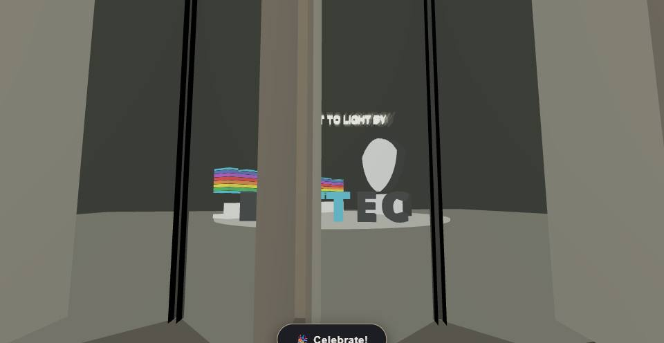
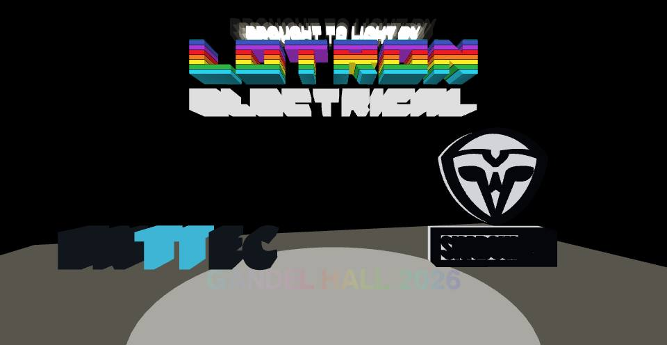
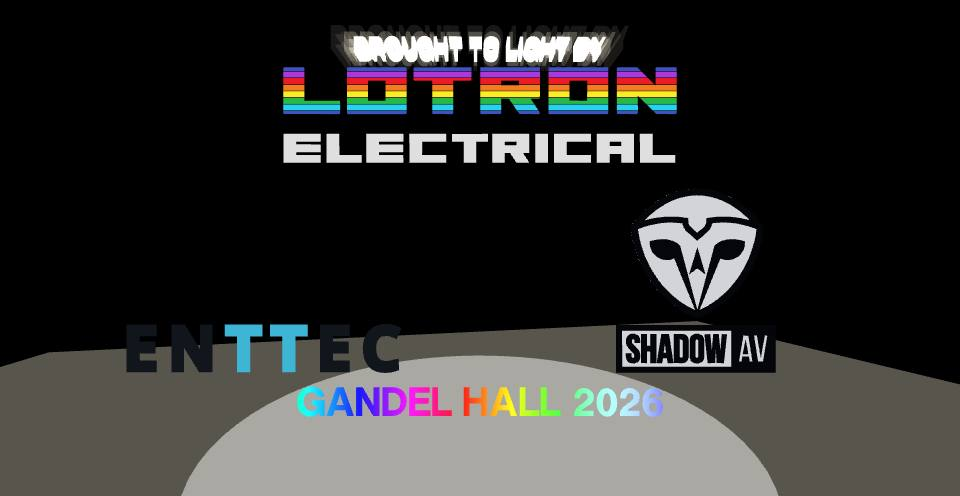
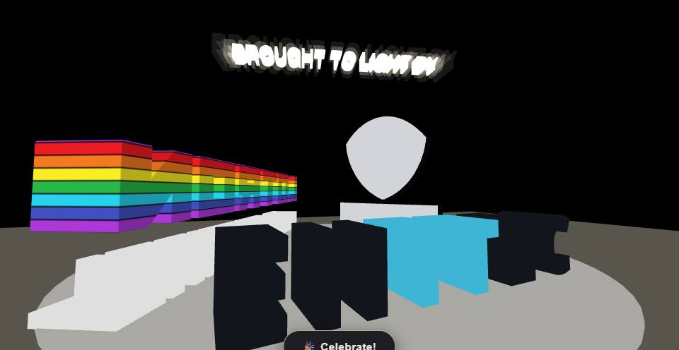
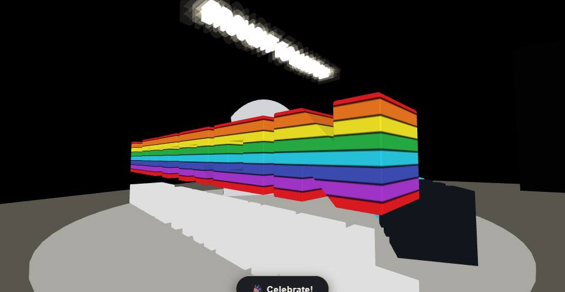
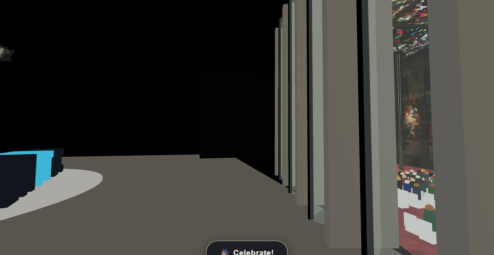

# Gandel Hall tour: camera storyboard

One block per camera path in the tour, in the order they play. Each block has three frames (start, middle, end), the timing, what the camera does, and a **Notes** line for you. Write anything under **Notes**; leave the rest alone and I will read the notes back and change the code to match.

The tour runs straight after the kaleidoscope. Total length about 173 s.

**How to read the positions.** Every camera point is written as `(u, h, d)` in hall metres:
- `u` runs along the hall, 0 at the screen-wall end, `uM` is the middle of the hall (about 26).
- `h` is eye height above the carpet.
- `d` is the distance out from the screen wall towards the glass; 7.6 is the object's line, 14 is at the glass.

"Fly" = a straight glide from the first point to the second, the look point sliding at the same time. "Hold" = the camera stands still, swaying gently, looking at one point.

---

## 1. Rainbow columns (house lights off)

Duration 16 s. Event: none (the columns run rainbow).

Fly from `(4, 1.7, 7.6)` to `(18.9, 0.9, 4.9)`: down the hall at head height, drifting across from the object's line to the wall-side lane (clear of the tables), looking ahead. Three title lines float 6 m ahead of the camera, one after another (4.4 s each): "A unique space", "Carefully crafted over decades", "Is brought to light". Over the last 3 s the camera drops to 0.9 m and tilts straight down to the carpet at its feet, midway between two columns and two tables, so the frame is carpet only.

| start | middle | end |
|---|---|---|
|  |  |  |

**Notes:** Text floating in the start reading 

"A unique space"
Then
"Carefully crafted over decades"
Then
"Is brought to light"

Have the camera move forwards down the hall and then before it gets to the end, look down and the floor and then when it pans up the dinner scene has started.

Notes:
The text is glowing to much.
Also make sure the text fits on the phone as well
"llight" should shimmer smoothly

---

## 2. Dinner

Duration 16 s. Event: `dinner` (tables set).

Starts where shot 1 ended, `(18.9, 0.9, 4.9)` looking straight down at the carpet, with the dinner already set. Holds the carpet 0.6 s, pans up over 2.5 s to face the centre of the room `(uM, 1.0, 9.5)` so the dinner is revealed, then rises and pushes slowly in to `(24, 2.6, 5.0)`, facing the centre throughout. "A space for community" floats over the dinner from 3.4 s to 9 s.

| start | middle | end |
|---|---|---|
|  |  |  |

**Notes:** Make sure the carpet is fully in view and matches the starting point from the end of the last clip. So that the dinner is fully revealed.

Text:
A space for community

---

## 3. Dinner celebrate

Duration 11 s. Celebrate fires at the start (the dinner lighting moment).

Hold at `(uM-7, 2.1, 13)`, by the glass, looking across the room at `(uM+2, 1.0, 6)`.

| start | middle | end |
|---|---|---|
|  |  |  |

**Notes:**

---

## 4. Party

Duration 16 s. Event: `party`.

From the floor at the hall's end `(8.4, 2.0, 9.5)`, round the room on a long curve (16 m along, 3.4 m across) and rising all the way, to end high up at `(28.4, 6.2, 12.8)` facing the crowd in the centre `(uM, 1.2, 9.5)`. Faces the centre throughout. "A place to come together" floats ahead from 2 s to 8 s.

| start | middle | end |
|---|---|---|
|  |  |  |

**Notes:** Text
A place to come together

Camera path, do not finish facing a blank wall. It would be better if it panned up and smoothly orbited around to end with a shot high up facing the crowd in the centre of the room

---

## 5. Party celebrate

Duration 14 s. Celebrate fires at the start.

Hold at `(uM+8, 2.4, 13)`, by the glass, looking back across at `(uM, 2.5, 5)`. "and celebrate amongst friends" floats ahead from 1 s to 7 s.

| start | middle | end |
|---|---|---|
|  |  |  |

**Notes:** Text:

and celebrate amongst friends

Also, in this clip, the party scene wasn't visible

---

## 6. Standing / cocktail

Duration 16 s. Event: `standing`.

A half circle round the speaker on the stage `(uM, 1.9, 1.6)`, 9 m out, from `(uM+7.6, 2.0, 6.5)` through `(uM, 2.3, 10.6)` to `(uM-7.6, 2.6, 6.5)`, facing the speaker the whole way. "A space for people to share their stories" floats ahead from 2 s to 8 s.

| start | middle | end |
|---|---|---|
|  |  |  |

**Notes:** The camera should be facing the stage and stay facing the speaker as it does a semi-circle orbit

Text:
"A space for people to share their stories"

---

## 7. Standing celebrate

Duration 12 s. Celebrate fires at the start.

Hold at `(uM-6, 2.3, 13)`, by the glass, looking across at `(uM, 2.0, 6)`.

| start | middle | end |
|---|---|---|
|  |  |  |

**Notes:** This clip currently shows no event

---

## 8. Wedding, the aisle

Duration 14 s. Event: `wedding` (chairs, aisle, the couple waiting).

Glide from `(uM, 1.7, 14.2)` at the glass to `(uM, 1.6, 5.2)`: straight down the aisle towards the screen wall, looking at the far end of the aisle `(uM, 1.5, 3.5)`. "A place to celebrate love" floats ahead from 2 s to 8 s.

| start | middle | end |
|---|---|---|
|  |  |  |

**Notes:** Text:
"A place to celebrate love"

---

## 9. Wedding, the walk

Duration 26.5 s. Celebrate fires at the start and the couple begin to walk: 20 s up the aisle, then 6 s across to the glass.

The camera follows 3.6 m behind the couple at shoulder height (1.8), looking a little ahead of them (1.3 m high). When they turn for the glass the camera cuts the corner.

| start | middle | end |
|---|---|---|
|  |  |  |

**Notes:** this clip is missing the event

---

## 10. Out to the courtyard

Duration 9 s. No event change.

Glide from `(26.6, 1.9, 12.6)` inside the glass out to 14 m in front of the sculpture, 3 m up, looking at the sculpture (4.5 m up it).

| start | middle | end |
|---|---|---|
|  |  |  |

**Notes:** This should walk through a doorway cut out in the glass.

Then It should be the final shot where all three of the logos rise up from the platform and align themselves into a triangle shape. Lotron on top, enttec bottom left and shadow av bottom right. With the brought to light by text above them, and then slowly it flattens from 3d to 2d and has text "Gandel Hall 2026" at the bottom in shimmering rainbow and then it holds for a few seconds and fades out.

---

## 11. Round the sculpture

Duration 22 s. The tour ends here and the camera is handed back.

A slow quarter-turn round the sculpture on a 15 m circle, 3.2 m up, looking at it (4 m up).

| start | middle | end |
|---|---|---|
|  |  |  |

**Notes:** this final clip isn't needed

---

## General notes

**Notes:**
