# Gandel Hall tour: camera storyboard

One block per camera path in the tour, in the order they play. Each block has three frames (start, middle, end), the timing, what the camera does, and a **Notes** line for you. Write anything under **Notes**; leave the rest alone and I will read the notes back and change the code to match.

The tour runs straight after the kaleidoscope. Total length about 162 s. Title lines are drawn over everything, so a column never hides them.

**How to read the positions.** Every camera point is written as `(u, h, d)` in hall metres:
- `u` runs along the hall, 0 at the screen-wall end, `uM` is the middle of the hall (about 26).
- `h` is eye height above the carpet.
- `d` is the distance out from the screen wall towards the glass; 7.6 is the object's line, 14 is at the glass.

"Fly" = a straight glide from the first point to the second, the look point sliding at the same time. "Hold" = the camera stands still, swaying gently, looking at one point.

---

## 1. Rainbow columns (house lights off)
<!-- shot: rainbow-columns -->

Duration 16 s. Event: none (the columns run rainbow).

Fly from `(4, 1.7, 7.6)` to `(18.9, 0.9, 4.9)`: down the hall at head height, drifting across from the object's line to the wall-side lane (clear of the tables), looking ahead. Three title lines float 6 m ahead of the camera, one after another (4.4 s each): "A unique space", "Carefully crafted over decades", "Is brought to light". Over the last 3 s the camera drops to 0.9 m and tilts straight down to the carpet at its feet, midway between two columns and two tables, so the frame is carpet only.

| start | middle | end |
|---|---|---|
| 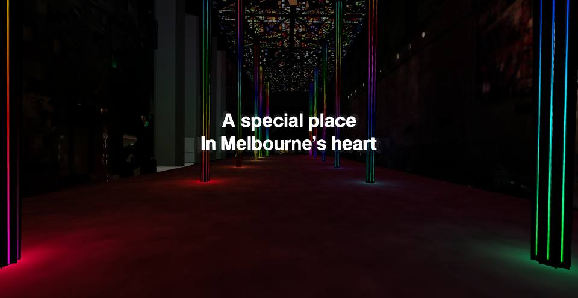 | 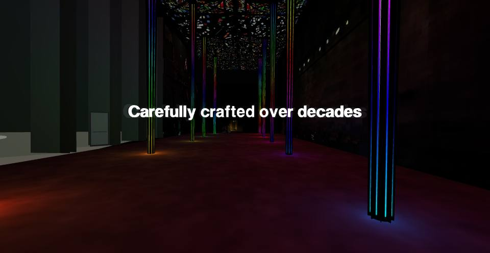 | 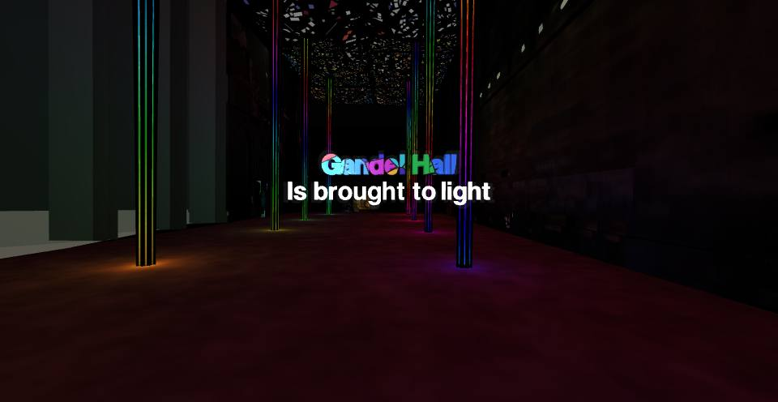 |

**Notes:**
V1 (sent earlier):
Text floating in the start reading 

"A unique space"
Then
"Carefully crafted over decades"
Then
"Is brought to light"

Have the camera move forwards down the hall and then before it gets to the end, look down and the floor and then when it pans up the dinner scene has started.

Notes:
The text is glowing to much.
Also make sure the text fits on the phone as well
"light" should shimmer smoothly

V3.
At the end, smoothly transition the brightness of the carpet into the next scene

V2 (sent 01/09/2026 22:05:32):
[shot 1, 10.1 s] 

Gandel Hall
Is brought to light

(Gandel Hall on the line above) Gandel Hall should also be stained glass text effect

V3 (sent 01/09/2026 22:12:00):
Gandel Hall text should be voronoi stained glass

V4 (sent 01/09/2026 22:17:42):
The gandel hall text is too hard to read. Too detailed. Make it low poly stained glass

V5 (sent 01/09/2026 22:52:32):
[shot 1, 12.8 s] 

The Gandel hall text should be much larger. Same width as the text line below it

V6 (sent 01/09/2026 23:14:05):
Try a new generation of the gandel hall text here

V7 (draft):

---

## 2. Dinner
<!-- shot: dinner -->

Duration 13 s. Event: `dinner` (tables set).

Starts where shot 1 ended, `(18.9, 0.9, 4.9)` looking straight down at the carpet, with the dinner already set. Holds the carpet 0.6 s, then pans up over 5 s (double ease) by pitch only, the yaw held down the hall as shot 1 left it, so there is no spin. From 5.6 s the camera lifts slowly from 0.9 m to 2.6 m while the look pans across the room to its centre `(uM, 1.0, 9.5)`, over 6.4 s. "A space for community." floats over the dinner from 5.5 s to 11 s; the shot fades to black over 11.5 s to 13 s and ends. The courtyard is hidden for this shot: plain glass, nothing outside. The house light comes up over 2.5 s at the start, so the carpet's brightness eases in from shot 1. The dinner is lively: fourteen guests up and about visiting other tables, everyone eating (heads to the plate) and drinking (the glass comes up), and a string quartet in white jackets plays in front of the stage, dead ahead as the camera comes up.

| start | middle | end |
|---|---|---|
|  | 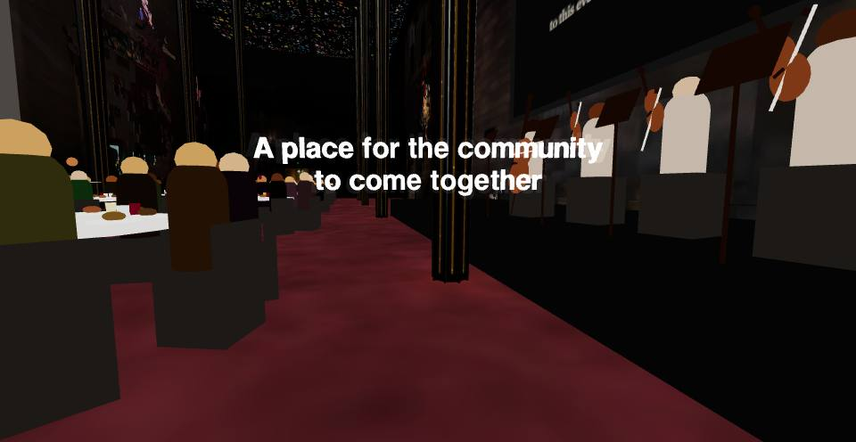 | 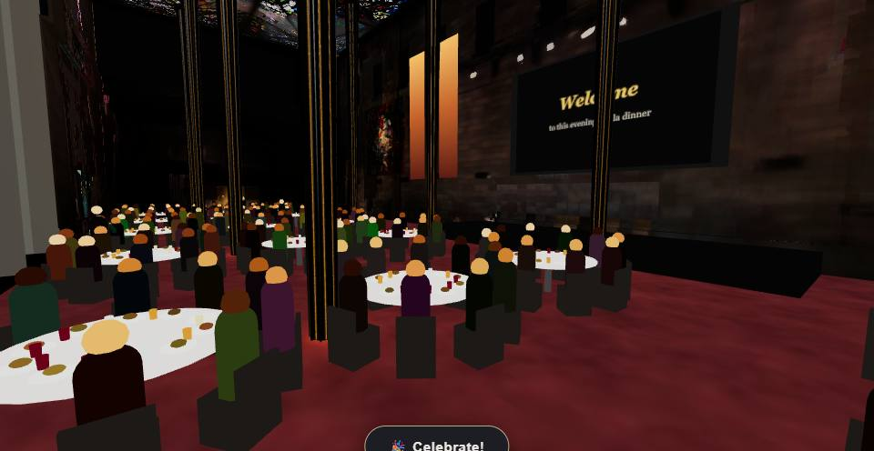 |

**Notes:**
V1 (sent earlier):
Make sure the carpet is fully in view and matches the starting point from the end of the last clip. So that the dinner is fully revealed.

Text:
A space for community.

V2.

the glass walls should be fully frosted here so we can't see the logo sculptures outside

V3.

The frosted glass is too frosted. Maybe instead, we have normal glass, and no sculptures outside.

At the starts the camera turns too fast. Smooth/ease that turn considerably or remove it.

V2 (sent 01/09/2026 22:03:22):
[shot 2, 1.2 s] 

Do not spin the camera here. Pan it back up smoothly, and then slowly lift the camera and pan across the room slowly
[shot 2, 11.2 s] 
After the text disappears, then fade out and end the shot

V3 (sent 01/09/2026 22:18:39):
Make the scene more lively. People moving around, chatting, mingling and eating and drinking. Also have a string quartet playing in frame

V4 (sent 01/09/2026 22:57:03):
[shot 2, 8.3 s] 

A place for community

V5 (sent 01/09/2026 23:26:44):
[shot 2, 4.7 s] the string quartet should be on stage. Improve their models as well to be more accurate

V6 (draft):

---

## 3. Banquet
<!-- shot: banquet -->

Duration 16 s. Event: `banquet` (one long table down the spine of the hall: draped ivory cloth in pleats, burgundy runner, gold hem, plates, food and glasses at every place, flowers and candles down the middle, guests seated both sides, everybody unique: jewel gowns, dark suits, pastels, brights, black and white, gold collars on some, big hats on some, crowns on a few, long flowing dresses on some, eating and chatting; four waiters walk the lanes behind the chairs with trays and step in to serve). "Where / Rich history and modern tradition / Come together" floats ahead from 2.5 s to 13.5 s, centred, the middle row coming in a word at a time.

Fades in from black over 1.5 s. Travels slowly along the table from `(uM-18, 1.9, 7.55)` to `(uM+12, 1.9, 7.55)`, just over the guests' heads, looking along the table 7 m ahead. Fades to black over the last 1.5 s.

| start | middle | end |
|---|---|---|
| 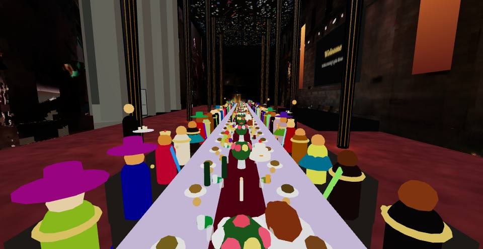 | 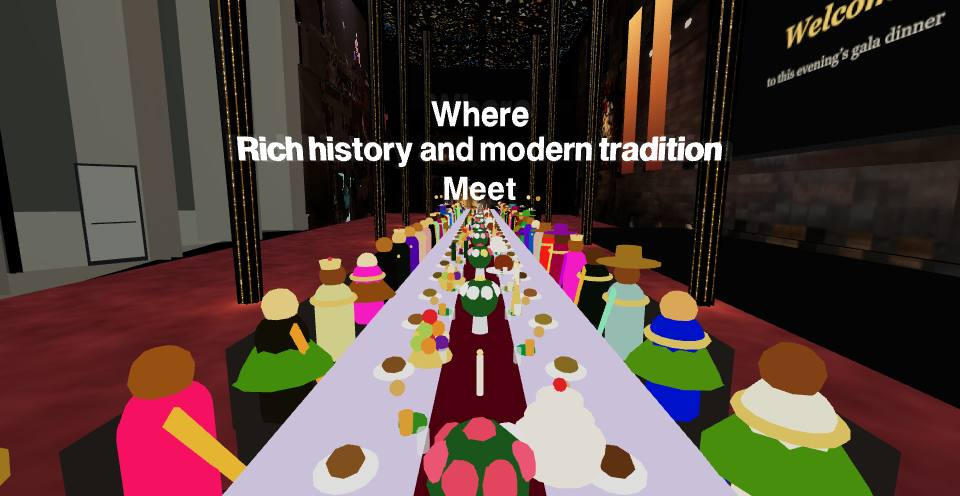 | 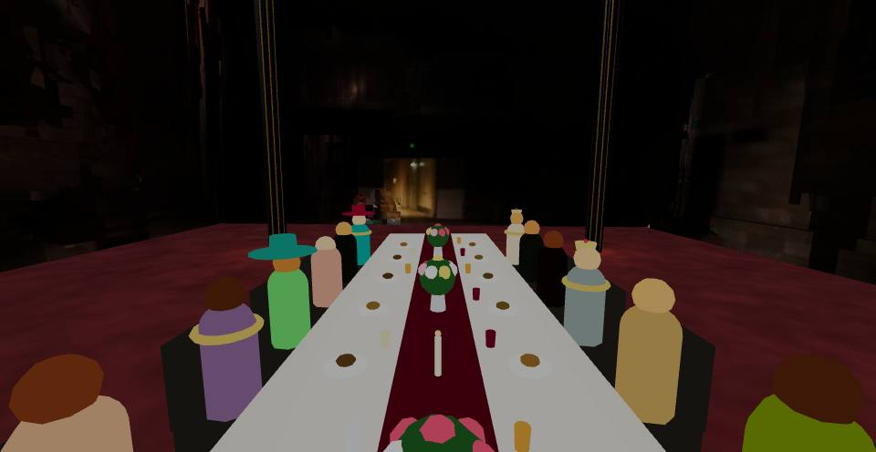 |

**Notes:**
V1 (sent earlier):
Add a new event type - Banquet.

Which is a long rectangular table going down the spine of the hall long ways. Have the camera fade in, for a shot of the camera moving down the banquet table. The banquet table should have food, flowers on it and people sitting at it. Also with ornate draped tablecloth. Fade out at the end of the shot

V2 (sent 01/09/2026 22:07:39):
[shot 3, 0.1 s] 

Have everyone wearing extravagant clothing. Like a modern royal banquet. Wait staff serving food and drinks. Everybody at the table eating or chatting to each other and having a good time

V3 (sent 01/09/2026 22:20:18):
Text (all centre aligned)

Where
Rich history and modern tradition (Each word fades in one after the other) (Line break)
Come together

More variety in clothes. Big hats, long flowing dresses. Not everyone with gold necklaces. Have everybody be unique. Also

V4 (sent 01/09/2026 22:39:47):
[shot 3, 3.0 s] 

Every word should fade in

V5 (sent 01/09/2026 22:56:01):
[shot 3, 0.7 s] 

More variety in all the extravagant clothing the guests are wearing. Also more food and drink. A proper banquet

V6 (sent 01/09/2026 23:29:11):
[shot 3, 2.2 s] more lavish and detailed banquet. larger types of food. more variety. also instead of the white tablecloth sides, use a light purple

V7 (draft):

---

## 4. Party
<!-- shot: party -->

Duration 16 s. Event: `party`.

From the floor at the hall's end `(8.4, 2.0, 9.5)`, round the room on a long curve (16 m along, 3.4 m across) and rising all the way, to end high up at `(28.4, 6.2, 12.8)` facing the crowd in the centre `(uM, 1.2, 9.5)`. Faces the centre throughout. Fades in from black over 1.5 s. "A place to have fun" floats ahead from 2 s to 8 s. Fades to black over the last 1.5 s.

| start | middle | end |
|---|---|---|
| 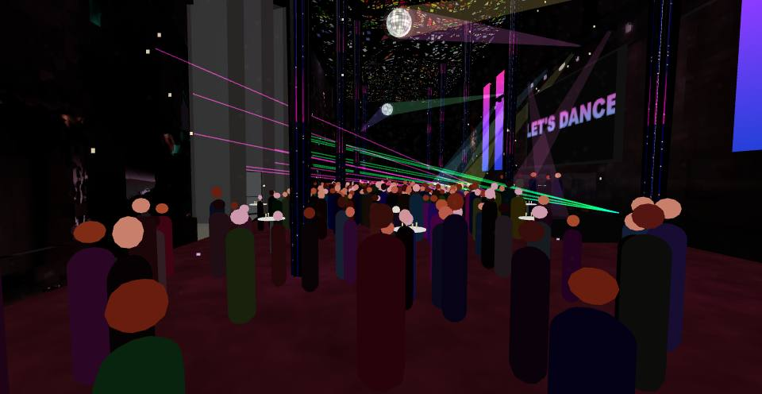 | 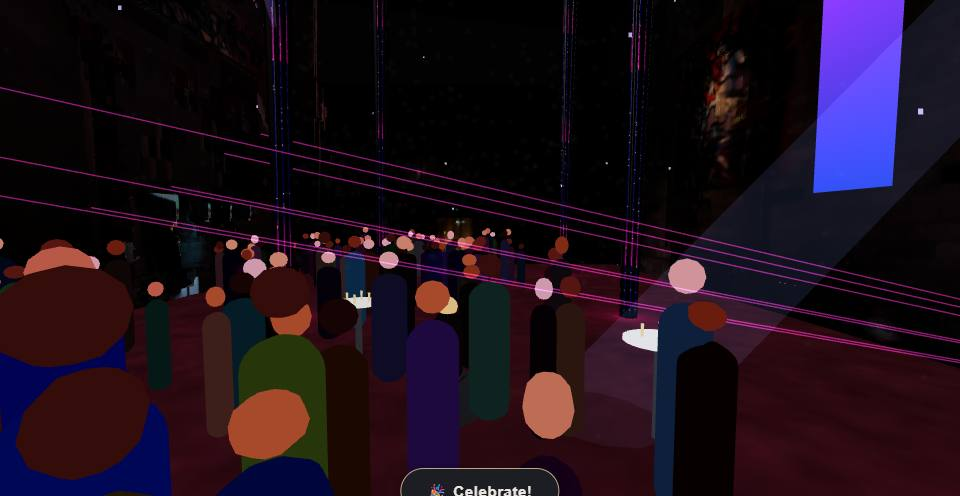 | 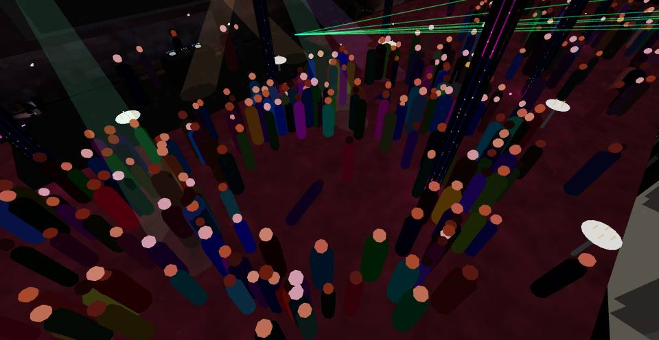 |

**Notes:**
V1 (sent earlier):
Text
A place to come together

Camera path, do not finish facing a blank wall. It would be better if it panned up and smoothly orbited around to end with a shot high up facing the crowd in the centre of the room

V2.

Fade out at the end

V3.

Fade in at the start of the shot.

Text "A place to have fun"

V2 (sent 01/09/2026 22:21:10):
A place to have fun!

V3 (draft):

---

## 5. Party celebrate
<!-- shot: party-celebrate -->

Duration 14 s. Celebrate fires at the start.

Starts at `(uM+8, 6.0, 10.5)`, under the falling paper so it is above the text, looking down on the crowd at `(uM, 1.2, 8.5)`, and comes down with the paper over 9 s (eased) to the hold at `(uM+8, 2.4, 13)` by the glass, looking back across at `(uM, 2.5, 5)`; holds there for the last 5 s. The cold sparks jet 1.5x higher. Fades in from black over 1.5 s. "and celebrate amongst friends" floats ahead from 1.5 s to 7.5 s.

| start | middle | end |
|---|---|---|
| 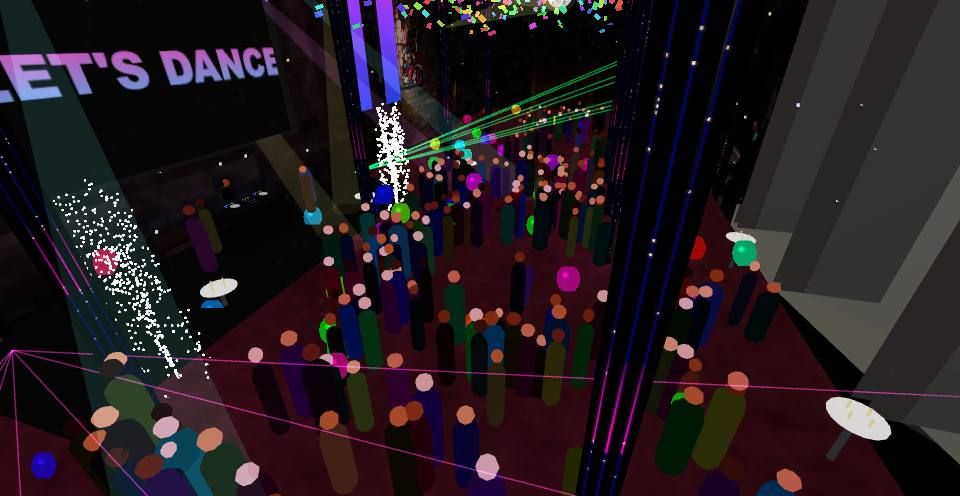 | 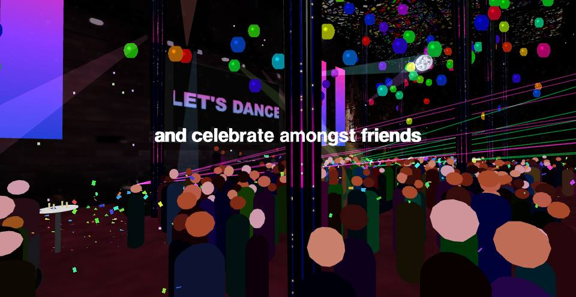 | 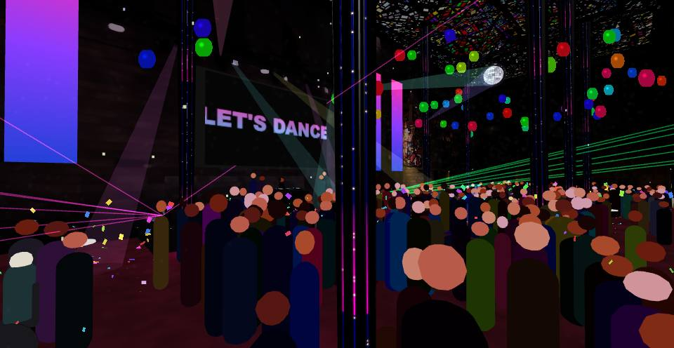 |

**Notes:**
V1 (sent earlier):
Text:

and celebrate amongst friends

Also, in this clip, the party scene wasn't visible.

V2.

Fade in at the start.

Also, the text was blocked by the columns

V3.

Start the camera high up and follow the confetti falling down, to finish at the end point of this current shot. Also, make the cold sparks go 1.5x higher

V2 (sent 01/09/2026 22:22:14):
the text gets washed out against the confetti. Maybe drop the camera lower, so the confetti is above the text at the start

V3 (sent 01/09/2026 22:42:32):
[shot 5, 11.3 s] 

Fade out at the end of this clip
[shot 5, 9.1 s] This is when the text should appear, not before

V4 (sent 01/09/2026 22:54:30):
[shot 5, 2.3 s] the text should appear now, and be in the centre of the screen

V5 (sent 01/09/2026 23:09:55):
[shot 5, 10.9 s] keep the people jumping excitedly during this scene

V6 (draft):

---

## 6. Standing / cocktail
<!-- shot: standing -->

Duration 16 s. Event: `standing`.

A half circle round the speaker on the stage `(uM, 1.9, 1.6)`, 9 m out, from `(uM+7.6, 2.0, 6.5)` through `(uM, 2.3, 10.6)` to `(uM-7.6, 2.6, 6.5)`, facing the speaker the whole way. "A space for people to share their stories" floats ahead from 2 s to 8 s.

| start | middle | end |
|---|---|---|
| 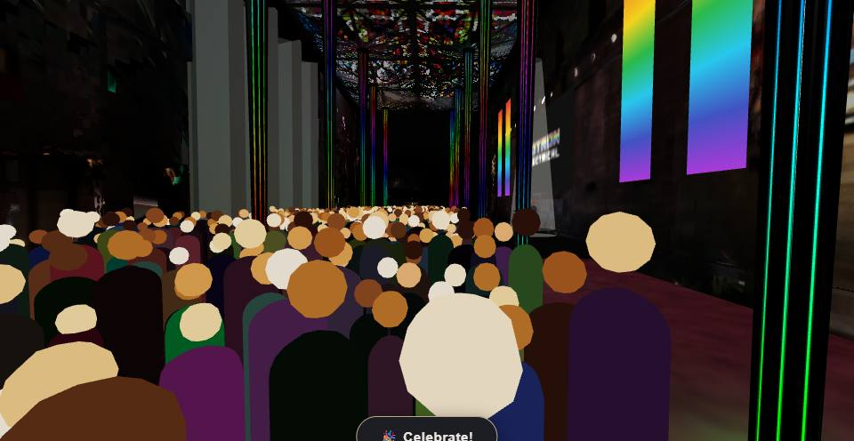 | 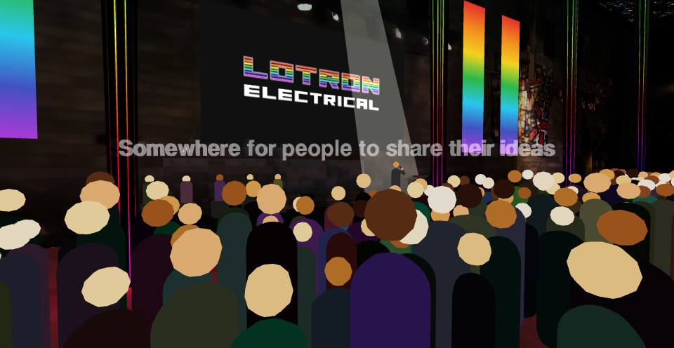 | 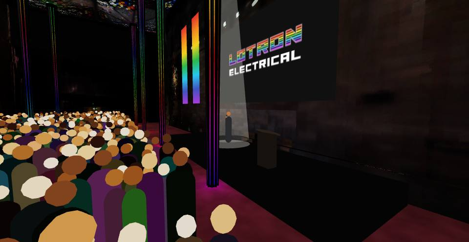 |

**Notes:**
V1 (sent earlier):
The camera should be facing the stage and stay facing the speaker as it does a semi-circle orbit

Text:
"A space for people to share their stories"

V2.
Make sure the text isn't blocked by the columns

V2 (sent 01/09/2026 22:28:49):
Fade in at the start of this clip

V3 (sent 01/09/2026 23:01:33):
[shot 6, 6.4 s]

V4 (draft):

---

## 7. Wedding, the aisle
<!-- shot: wedding-aisle -->

Duration 14 s. Event: `wedding` (chairs, aisle, the couple waiting).

Glide from `(uM, 1.7, 14.2)` at the glass to `(uM, 1.6, 5.2)`: straight down the aisle towards the screen wall, looking at the far end of the aisle `(uM, 1.5, 3.5)`. "A place to celebrate love" floats ahead from 2 s to 8 s.

| start | middle | end |
|---|---|---|
| 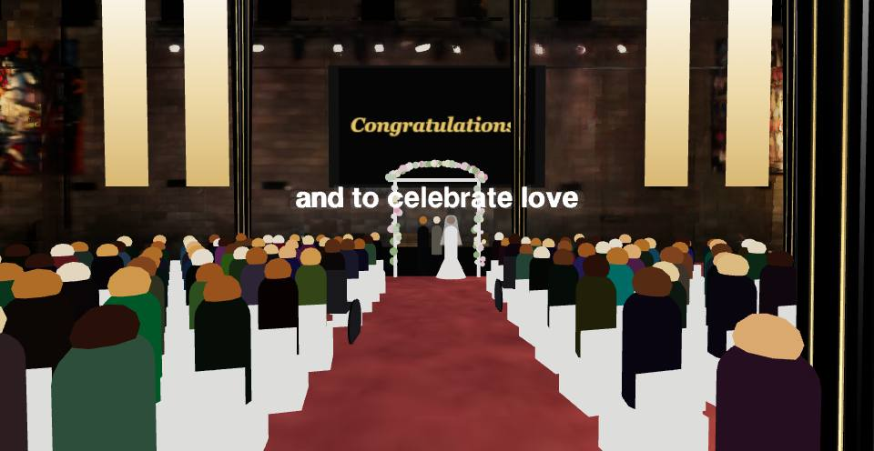 | 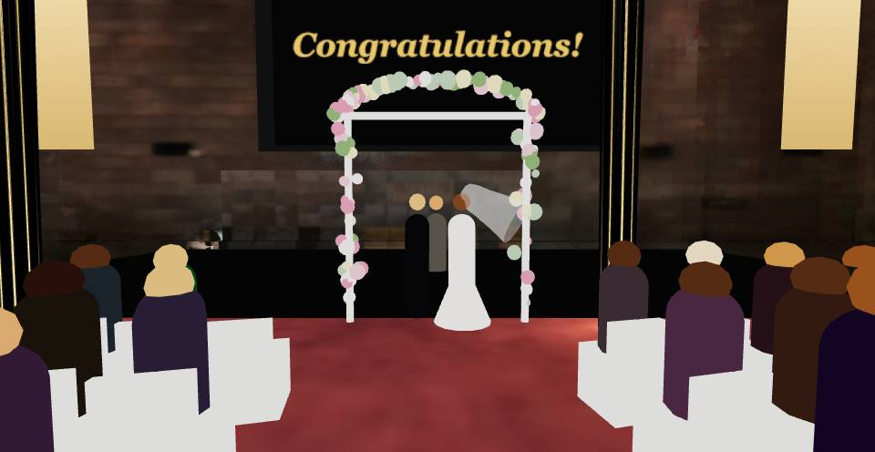 | 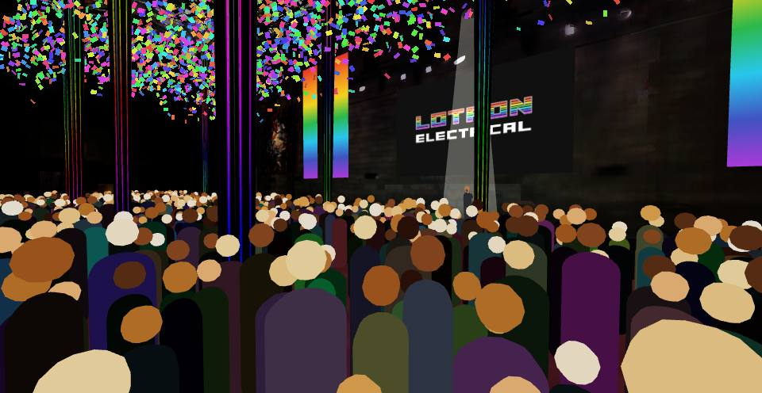 |

**Notes:**
V1 (sent 01/09/2026 22:22:51):
and to celebrate love

V2 (sent 01/09/2026 22:47:37):
The bride needs a proper veil, and then there should be a scene where they turn to each other, the veil is lifted and they kiss. The groom holds onto the bride and dips her

V3 (sent 01/09/2026 23:13:22):
[shot 7, 3.0 s] the veil should not be a cone. It should have a smooth top on the brides head. Then is opened up. Then when they lean to kiss, they don't clip into each other

V4 (draft):

---

## 8. Wedding, the walk
<!-- shot: wedding-walk -->

Duration 26.5 s. Celebrate fires at the start and the couple begin to walk: 20 s up the aisle, then 6 s across to the glass.

The camera follows 3.6 m behind the couple at shoulder height (1.8), looking a little ahead of them (1.3 m high). When they turn for the glass the camera cuts the corner. The rice falls on its own arc and lies on the floor where it lands for the rest of the walk; a grain that meets a head glances off it and drops from there.

| start | middle | end |
|---|---|---|
| 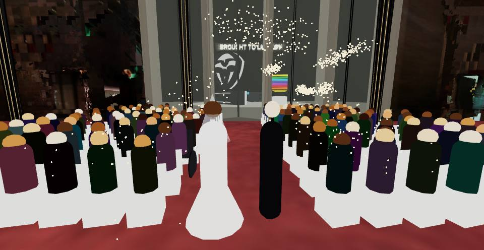 | 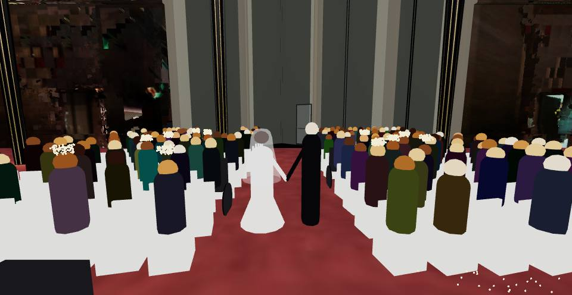 | 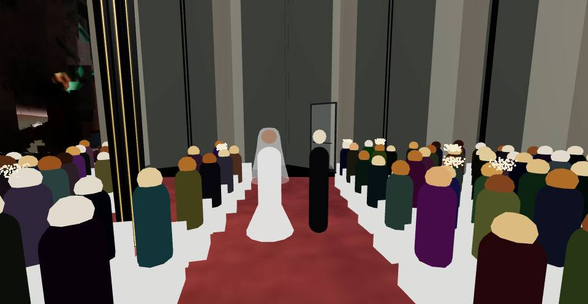 |

**Notes:**
V1 (sent earlier):
the rice should be landing on the floor and not disappearing right away.  Also, it seems that it's sticking to invisible boxes on top of people. It should fall realistically

V2 (sent 01/09/2026 22:23:22):
the rice is phasing through the floor. It should land on the floor and stay during the scene

V3 (sent 01/09/2026 22:45:06):
No logos outside for this scene

V4 (sent 01/09/2026 22:59:23):
[shot 8, 11.0 s] the rice is phasing through the floor. It should be landing on the floor and staying through the scene

V5 (sent 01/09/2026 23:26:53):
[shot 8, 6.2 s] the crowd should keep jumping through the scene

V6 (draft):

---

## 9. The finale: out to the courtyard
<!-- shot: finale -->

Duration 27 s (walk 8, rise 8, flatten 5, hold 4, fade 2). The tour ends here; the picture fades back in on the free view.

Walks at head height through a doorway cut in the glass on the court's axis, out to 6 m into the court, looking at the sculpture. Then the camera drifts back and up to frame the whole triangle while the three marks rise off the turntable and align facing the hall: Lotron on top, ENTTEC bottom left, Shadow AV bottom right, BROUGHT TO LIGHT BY above them. The triangle flattens from 3D to 2D and GANDEL HALL 2026 comes up beneath it in shimmering rainbow; holds 4 s; fades to black. (Lloyd, V2) As the flattening begins the picture dips to black and comes back with the court, the hall and the sky gone: the marks alone on black. The partners sit closer together and Lotron closer above them. GANDEL HALL, large, in low-poly Voronoi stained glass, stands above BROUGHT TO LIGHT BY, level and square to the camera; there is no year at the foot; ENTTEC's letters turn white on the black, and the two partner marks are about the same size.

| start | middle | end |
|---|---|---|
| 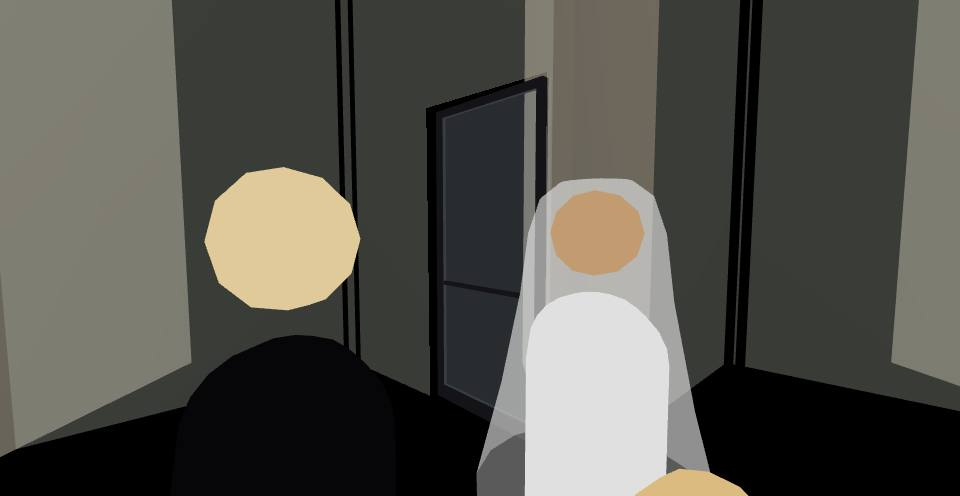 | 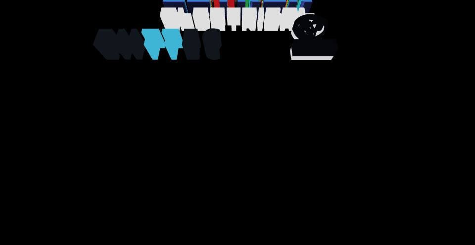 | 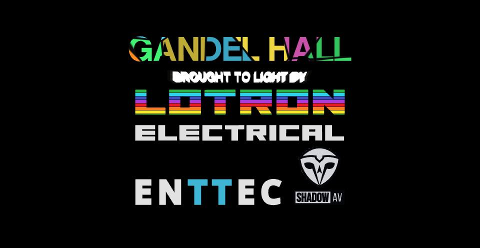 |

**Notes:**
V1 (sent earlier):
This should walk through a doorway cut out in the glass.

Then It should be the final shot where all three of the logos rise up from the platform and align themselves into a triangle shape. Lotron on top, enttec bottom left and shadow av bottom right. With the brought to light by text above them, and then slowly it flattens from 3d to 2d and has text "Gandel Hall 2026" at the bottom in shimmering rainbow and then it holds for a few seconds and fades out.

V2 (sent 01/09/2026 22:16:12):
[shot 9, 17.7 s] 

The final scene should have a completely black background. Also, have the logos closer together.

Gandel Hall in large Voronoi Stained glass text above the brought to light by

V3 (sent 01/09/2026 22:26:39):
Remove gandel hall 2026

Then, the voronoi gandel hall text at the top should be low poly voronoi effect so it is easier to read. Right now it is too detailed. Then also make sure the text is level, and facing the camera.

Dark enttec letters should be white so they contrast on the black background.

Try to get the enttec and shadow av logos roughly the same size. Maybe make the shadow av owl smaller

V4 (sent 01/09/2026 22:44:30):
The entrance through the glass isn't cut out through the glass walls like this in real life. Each glass window has a door at the bottom of it. Just open one of those doors and walk through it. Don't cut through the wall like this

V5 (sent 01/09/2026 23:26:59):
The dark blue in gandel hall doesn't contrast well on the black, use different colours

V6 (draft):

---

## General notes
<!-- shot: general -->

**Notes:**
V1 (draft):

